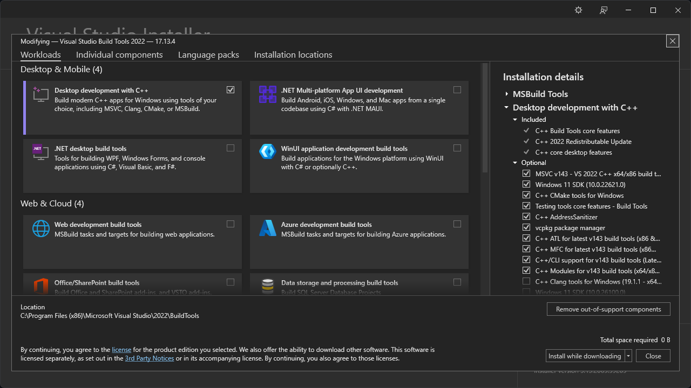

# Build Retr0Mine on Windows

## Prerequisites

- Git
- MSVC Build tools 2022
- Qt toolchain and Qt Creator

## Install Git

- Download and install [Git for Windows](https://github.com/git-for-windows/git/releases/download/v2.49.0.windows.1/Git-2.49.0-64-bit.exe)
- Start a Windows Terminal / Powershell and clone Retr0Mine: `git clone https://github.com/Odizinne/Retr0Mine.git`

## Install Build tools

- Download and execute [MSVC build tools](https://aka.ms/vs/17/release/vs_BuildTools.exe)
- Check the following and install them

## Install Qt toolchain

- Create a Qt account and download [Qt online installer](https://www.qt.io/download-qt-installer-oss?hsLang=en) for Windows 64bit
- Launch the installer and sign in with your created account
- Check `"I'm an individual..."`
- Select custom installation and install the following:

Under Qt 6.8.3 check `MSVC 2022 64bit`. Under additional libraries check `Qt Multimedia`  
Under Build tools check `CMake` and `Ninja`  
Under Qt Creator check `Qt Creator`

## Build

- Launch Qt Creator
- File -> open file or project -> select CmakeLists.txt from the cloned Retr0Mine dir.
- Wait for Cmake to configure the project, then Build -> Run (or Ctrl + R)

Retr0Mine should build and run.
