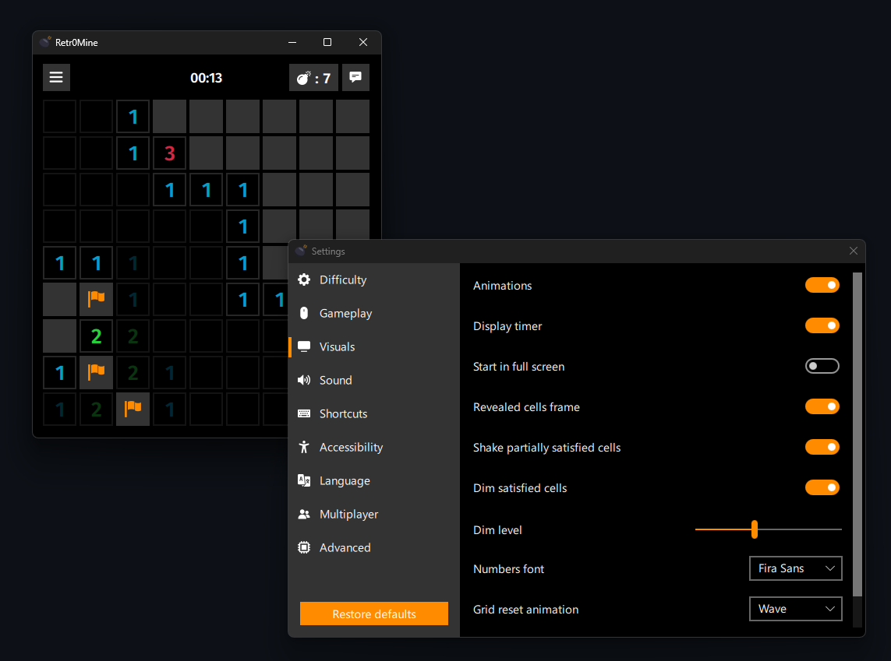

# Retr0Mine

Modern UI minesweeper created for a friend.  
Runs on windows | linux.

If you like my work, consider supporting me!

  

# Download

**Note:** Steam deck users with firefox should right click on `Download` -> `save file as` and save to desktop.  
Remove `.download` extension after downloading.  
You can then click the installer on your desktop.
After installation you can right click Retr0Mine in your application menu and select `Add to steam` if you want to be able to run it from gamemode.

**Note:** ColorScheme cannot be forced on linux for now.  
I made a Steam Deck dark theme, available in gamemode session.

| OS                     | Platform  | Download                                                                                                       |
|------------------------|-----------|----------------------------------------------------------------------------------------------------------------|
| Windows Installer      | x64       | [Download](https://github.com/Odizinne/Retr0Mine/releases/latest/download/Retr0Mine_Installer.exe)             |
| Windows Portable       | x64       | [Download](https://github.com/Odizinne/Retr0Mine/releases/latest/download/Retr0Mine_msvc_64.zip)               |
| Linux Appimage         | x64       | [Download](https://github.com/Odizinne/Retr0Mine/releases/latest/download/Retr0Mine-x86_64.AppImage)           |
| Linux Bin              | x64       | [Download](https://github.com/Odizinne/Retr0Mine/releases/latest/download/Retr0Mine_linux_64.zip)              |
| SteamDeck installer    | x64       | [Download](https://raw.githubusercontent.com/Odizinne/Retr0Mine/main/Retr0Mine_SteamDeckInstaller.desktop)     |

Linux binaries require Qt6.8 to use FluentWinUI3 theme

# Features

- Save / load game state
- You cannot hit a mine on first click
- QoL features such as reveal by clicking on connected cells

# Shortcuts

- `Ctrl+Q` Quit
- `Ctrl+N` New game
- `Ctrl+S` Save dialog
- `Ctrl+P` Settings
- `F11`    Fullscreen (G4m3r)

# Translations

- EN (me)
- FR (me)

Other translations were made by AI. Feel free to submit a pull request if you notice any inaccuracies.

# Resources

- Used PopOs sound effects from [PopOs GTK-Theme](https://github.com/pop-os/gtk-theme)
- Used KDE ocean sound effects from [ocea-sound-theme](https://github.com/KDE/ocean-sound-theme)

Ocean sound effects used are licensed under [cc by sa 4.0](https://creativecommons.org/licenses/by-sa/4.0/).
